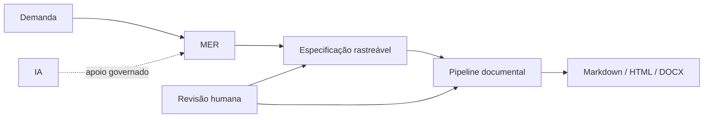

# SAF — System Analysis Framework

**Framework público para Engenharia de Requisitos e Análise de Sistemas, da demanda incompleta à especificação rastreável.**

[](https://github.com/LSANTOSSS/SAF/actions/workflows/saf-pipeline.yml)
[](https://github.com/LSANTOSSS/SAF)
[](LICENSE)

O **SAF** demonstra um fluxo estruturado de análise em que evidências, hipóteses, gaps, decisões e requisitos são tratados de forma distinta, com **IA como apoio governado** e revisão humana obrigatória.

A versão 1.0 consolida o **MER — Método de Engenharia de Requisitos** como núcleo do framework e valida sua reutilização em três domínios fictícios e independentes.

> **Versão estável:** v1.0.0 — Stable Public Framework

## O problema

Demandas de software raramente chegam completas. Informações faltantes, decisões implícitas, regras contraditórias e pressupostos não validados podem virar requisitos frágeis quando não existe um processo explícito de análise.

O SAF organiza essa transição:



O MER diferencia **evidência, inferência, hipótese, gap, decisão e requisito**. Hipóteses não viram requisitos diretamente, e IA não substitui fonte, decisão ou aprovação humana.

## Três provas de reutilização

| Case | Foco |
| --- | --- |
| [`room-booking`](examples/room-booking/) | conflitos, disponibilidade e regras temporais |
| [`service-request`](examples/service-request/) | workflow, estados, prioridade e SLA |
| [`purchase-request`](examples/purchase-request/) | aprovação, alçadas e segregação de responsabilidade |

O consolidado dos três experimentos está em [`docs/04-framework/final-result.md`](docs/04-framework/final-result.md).

## O que este projeto demonstra

- Engenharia de Requisitos;
- Análise de Sistemas;
- rastreabilidade entre descoberta, decisão e requisito;
- identificação e tratamento explícito de gaps;
- governança de uso de IA;
- modelagem de workflows e regras de negócio;
- documentação versionada em Markdown;
- automação documental;
- testes e pipeline com GitHub Actions;
- publicação clean-room de cases fictícios.

## Explore

1. [`Resultado final dos três MER`](docs/04-framework/final-result.md)
2. [`MER`](docs/01-mer/README.md)
3. [`IA aplicada`](docs/02-ai-applied/README.md)
4. [`Automação`](automation/README.md)
5. [`Governança de publicação`](docs/00-governance/publication-safety.md)

## Execute

Requer Python 3 e não utiliza dependências externas.

```bash
python -m unittest discover -s tests -v
python automation/saf_pipeline.py examples/room-booking --build-dir build/room-booking
python automation/saf_pipeline.py examples/service-request --build-dir build/service-request
python automation/saf_pipeline.py examples/purchase-request --build-dir build/purchase-request
```

Markdown versionado é a fonte controlada. HTML e DOCX são artefatos derivados e regeneráveis.

## SAF + DocFlow

O SAF e o [DocFlow](https://github.com/LSANTOSSS/docflow) formam duas peças complementares do portfólio:

| Projeto | Demonstra |
| --- | --- |
| **SAF** | análise, Engenharia de Requisitos, rastreabilidade, governança e método |
| **DocFlow** | Python, CLI, parsing, validação, automação documental, testes e CI/CD |

O SAF mostra **como estruturar o problema e chegar a uma especificação defensável**. O DocFlow mostra **como transformar conteúdo estruturado em entregáveis automatizados e multi-formato**.

Os dois projetos são independentes, públicos e clean-room.

## Segurança de publicação

O SAF não representa o processo interno de nenhuma empresa. Seus exemplos são independentes, fictícios e desenvolvidos exclusivamente para demonstração pública.

## Roadmap e histórico

Consulte [`ROADMAP.md`](ROADMAP.md) e [`CHANGELOG.md`](CHANGELOG.md).

## Licença

MIT — consulte [`LICENSE`](LICENSE).
