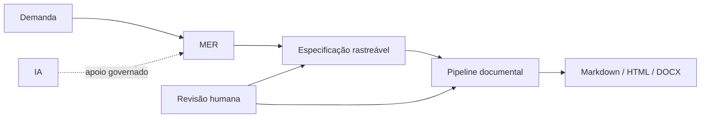

# SAF — System Analysis Framework

> Um framework público para Engenharia de Requisitos e Análise de Sistemas: da demanda incompleta à especificação rastreável, com IA governada e automação documental.

## SAF 1.0

A versão 1.0 consolida o **MER — Método de Engenharia de Requisitos** como núcleo do SAF e valida sua reutilização em três domínios fictícios.

**Resultado principal:** [`docs/04-framework/final-result.md`](docs/04-framework/final-result.md)

### Três provas de reutilização

| Case | Foco |
|---|---|
| [`room-booking`](examples/room-booking/) | conflitos, disponibilidade e regras temporais |
| [`service-request`](examples/service-request/) | workflow, estados, prioridade e SLA |
| [`purchase-request`](examples/purchase-request/) | aprovação, alçadas e segregação de responsabilidade |

## Como funciona



O MER diferencia evidência, inferência, hipótese, gap, decisão e requisito. Hipóteses não viram requisitos diretamente. IA não substitui fonte, decisão ou aprovação humana.

## Explore

1. [`Resultado final dos três MER`](docs/04-framework/final-result.md)
2. [`MER`](docs/01-mer/README.md)
3. [`IA aplicada`](docs/02-ai-applied/README.md)
4. [`Automação`](automation/README.md)
5. [`Governança de publicação`](docs/00-governance/publication-safety.md)

## Execute

Requer Python 3 e não utiliza dependências externas.

```bash
python -m unittest discover -s tests -v
python automation/saf_pipeline.py examples/room-booking --build-dir build/room-booking
python automation/saf_pipeline.py examples/service-request --build-dir build/service-request
python automation/saf_pipeline.py examples/purchase-request --build-dir build/purchase-request
```

## Fonte e entrega

Markdown versionado é a fonte controlada. HTML e DOCX são artefatos derivados e regeneráveis.

## Versão

**v1.0.0 — Stable Public Framework**

## Segurança de publicação

O SAF não representa o processo interno de nenhuma empresa. Seus exemplos são independentes, fictícios e clean-room.

## Roadmap e histórico

Consulte [`ROADMAP.md`](ROADMAP.md) e [`CHANGELOG.md`](CHANGELOG.md).

## Licença

MIT — consulte [`LICENSE`](LICENSE).
