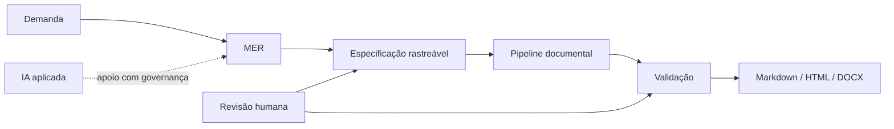

# SAF — System Analysis Framework

> Engenharia de Requisitos, Análise de Sistemas, IA responsável e automação documental em um framework público, rastreável e executável.

## Em 60 segundos

O **SAF** demonstra como uma demanda incompleta pode evoluir até uma especificação funcional revisável sem transformar suposições em requisitos. O **MER — Método de Engenharia de Requisitos** é seu núcleo metodológico.

### O que este projeto demonstra

| Capacidade | Evidência |
|---|---|
| Engenharia de Requisitos | [`docs/01-mer/`](docs/01-mer/) |
| Análise ponta a ponta | [`examples/room-booking/`](examples/room-booking/) |
| Reutilização do método | [`examples/service-request/`](examples/service-request/) |
| Rastreabilidade | [`examples/service-request/06-traceability.md`](examples/service-request/06-traceability.md) |
| IA com revisão humana | [`docs/02-ai-applied/`](docs/02-ai-applied/) |
| Automação documental | [`automation/`](automation/) |
| Exportação Markdown → DOCX | [`automation/docx_exporter.py`](automation/docx_exporter.py) |
| Segurança de publicação | [`docs/00-governance/publication-safety.md`](docs/00-governance/publication-safety.md) |

## Como o SAF se conecta



## Comece por aqui

1. [`MER`](docs/01-mer/README.md)
2. [`Case room-booking`](examples/room-booking/README.md)
3. [`Case service-request`](examples/service-request/README.md)
4. [`Rastreabilidade do segundo case`](examples/service-request/06-traceability.md)
5. [`Governança de IA`](docs/02-ai-applied/README.md)
6. [`Automação`](automation/README.md)

### Quick start

Requer Python 3 e não utiliza dependências externas.

```bash
python automation/saf_pipeline.py examples/room-booking
python automation/saf_pipeline.py examples/service-request --build-dir build/service-request
```

Os dois cases utilizam o mesmo pipeline e podem gerar Markdown, HTML e DOCX.

## Princípio central

O MER diferencia fato, evidência, inferência, hipótese, gap, decisão e requisito. IA pode apoiar a análise, mas não substitui fontes, decisões ou revisão humana. A automação valida e deriva artefatos sem alterar silenciosamente o conteúdo funcional.

## Current version

**v0.9.0 — Second Case Study**

Esta versão demonstra a reutilização do MER e do pipeline em um segundo domínio fictício, agora orientado a workflow, estados, prioridade, SLA, responsabilidade e histórico.

## Segurança de publicação

O SAF não representa o processo interno de nenhuma empresa. Seus exemplos são independentes e fictícios. Veja [`publication-safety.md`](docs/00-governance/publication-safety.md).

## Roadmap e histórico

Consulte [`ROADMAP.md`](ROADMAP.md) e [`CHANGELOG.md`](CHANGELOG.md).

## Licença

MIT — consulte [`LICENSE`](LICENSE).
